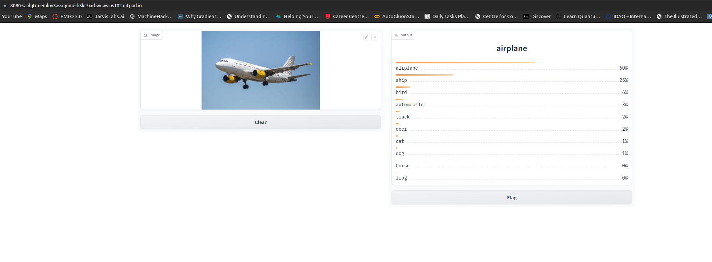
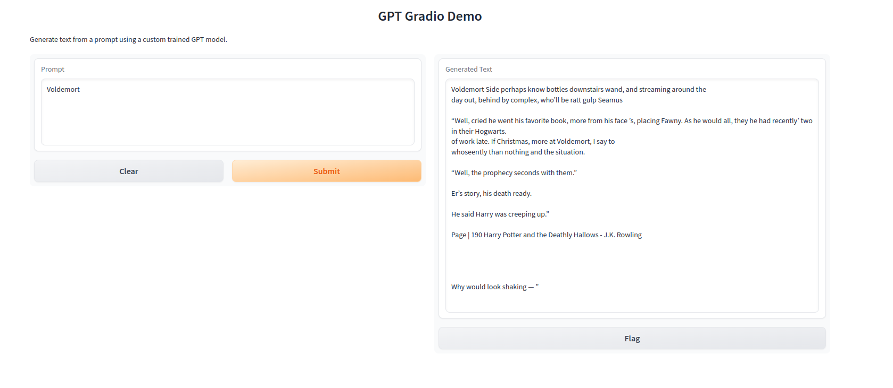

# EMLOv3 | Assignment 8

[](https://pytorch.org/get-started/locally/)
[](https://pytorchlightning.ai/)
[](https://hydra.cc/)
[](https://black.readthedocs.io/en/stable/)


## Adamantium 

<em>The name is inspired by the metal alloy which is bonded to the character Wolverine's skeleton and claws.</em>

Adamantium is a custom python package which currently supports:
- Usage of any model available in TIMM for training & evalution on CIFAR10 dataset. 
- VIT model for training, evaluation & inference on Cats-Dogs & CIFAR10 dataset.
- GPT model training and optuna based hyperparameter optimization over Harry Potter books dataset.
- Experiment tracking using MLFlow, AIM, Tensorboard & CSV logger.
- Demo of VIT and GPT model using gradio.

All functionalities can be controlled by hydra configs.

## VIT (scripted) Gradio Demo

1. Pull the docker image from dockerhub.
```bash
docker pull salilgtm/emlov3_assignment_8:latest
```

2. Run the docker image.
```bash
docker run -p 8080:8080 salilgtm/emlov3_assignment_8:latest
```



Notes:
- The docker image size is 1.27GB.
- Model performance can be drastically improved, current aim was to get a working gradio demo.

## GPT (trace) Gradio Demo

1. To run the demo, clone the repository.
```bash
git clone https://github.com/salil-gtm/emlov3_assignment_8.git
```

2. Install the requirements.
```bash
pip install -r requirements.txt
```

3. Install Adamantium.
```bash
pip install -e .
```

4. Run the demo.
```bash
adamantium_demo_gpt
```



## Past Documentation

- [Assignment 4](https://github.com/salil-gtm/emlov3_assignment_4)
- [Assignment 5](https://github.com/salil-gtm/emlov3_assignment_5)
- [Assignment 6](https://github.com/salil-gtm/emlov3_assignment_6)
- [Assignment 7](https://github.com/salil-gtm/emlov3_assignment_7)

## Author

- Salil Gautam